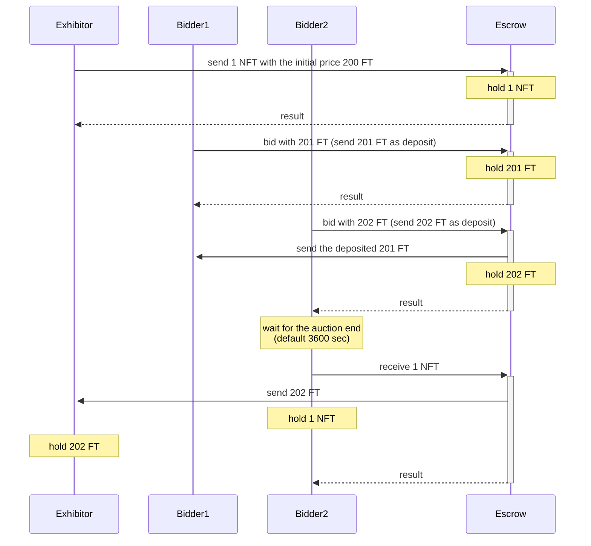
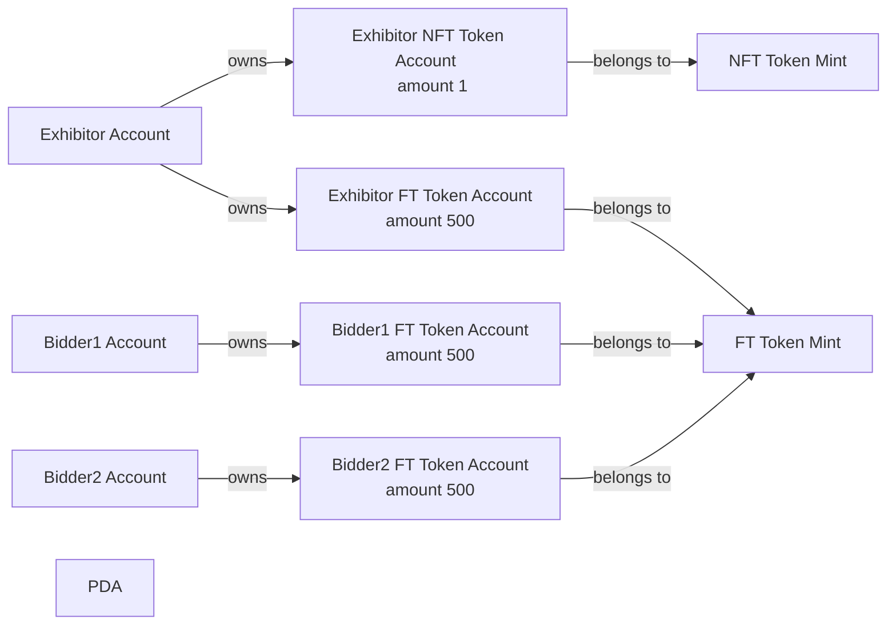
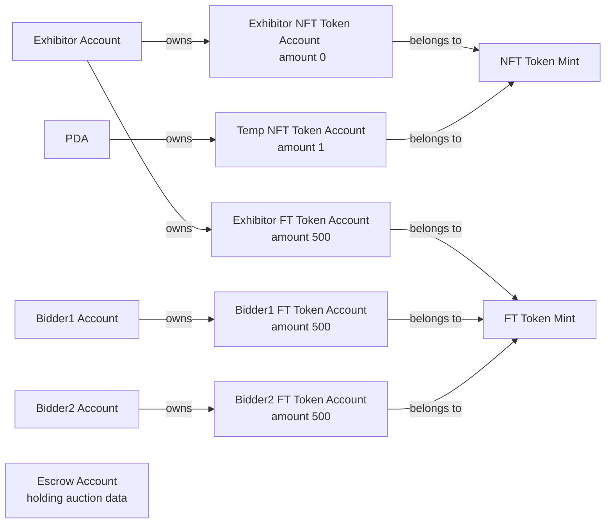
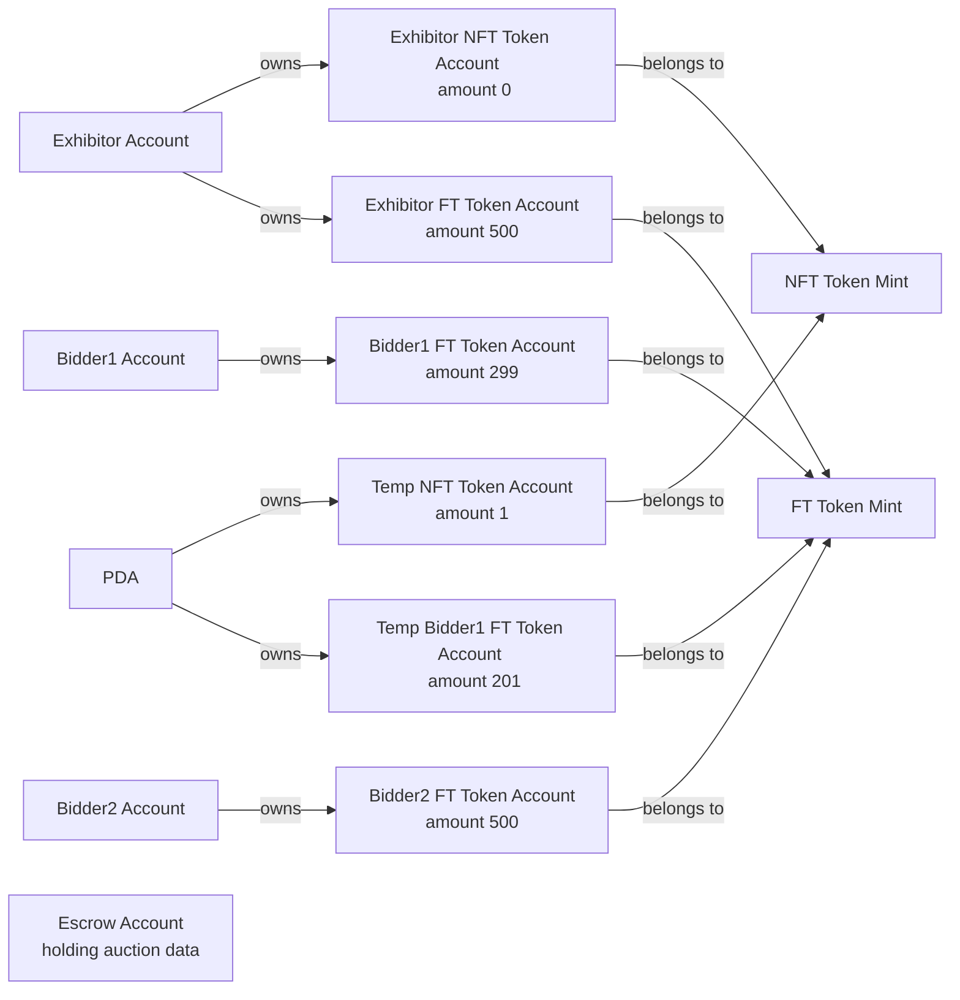
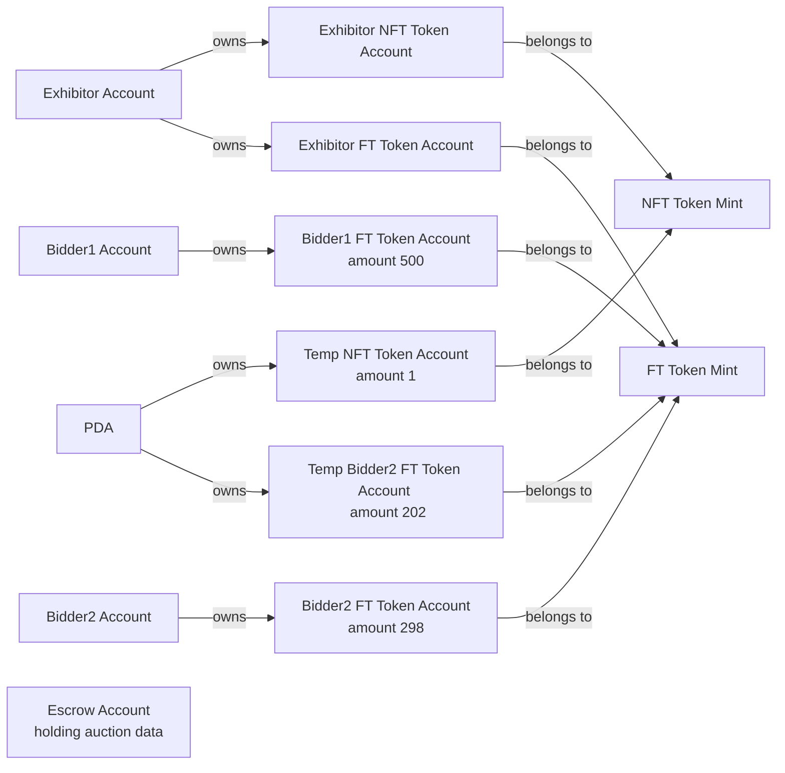
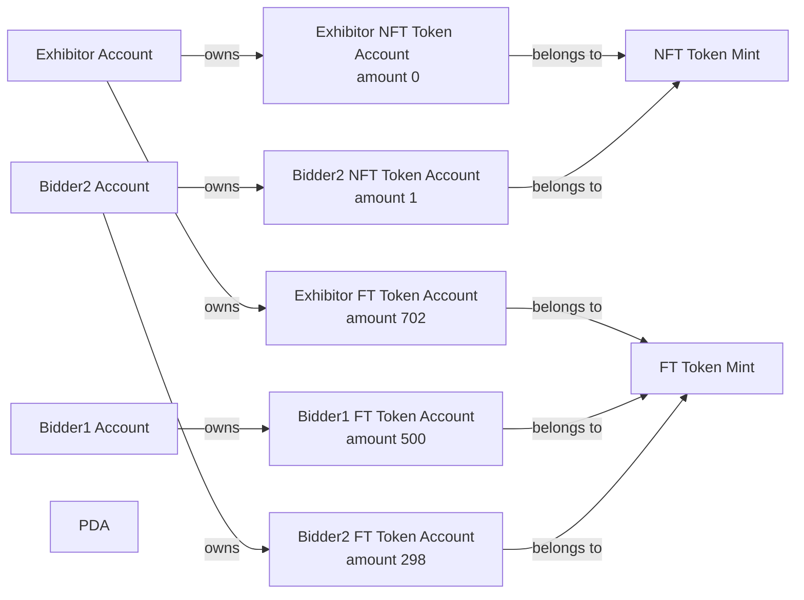

# solana-auction 

This is the recipe to develop auction program on [solana](https://solana.com/) chain.

## Prerequisite knowledge for this recipe
* [Solana Cookbook](https://solanacookbook.com/)
* [About Escrow](https://paulx.dev/blog/2021/01/14/programming-on-solana-an-introduction/)

## Specifications of this auction system
An auction system in which bidders pay FT and make a successful bid for the listed NFT.



* The exhibitor exhibits any NFT
  - Determine the initial price (amount of FT required) at the time of listing
  - Set the auction deadline at the time of listing
* The bidder decides the bid amount and bids
  - Bidder cannot bid without specifying a higher price than existing bidders
  - Bidder cannot bid on expired auctions
  - To prevent unsettled, Bidder deposits FT at the time of bidding
  - If another bidder specifies a higher price than current one, the bid right will move and the deposited FT will be converted.
* The exhibitor can cancel the auction
  - Only the exhibitor can cancel
  - If even one person is bidding, it cannot be canceled
  - NFT returns to the exhibitor
* The highest bidder after the auction deadline is the winning bidder.
  - Only the winning bidder can receive the NFT
  - The FT deposited by the winning bidder is moved to the exhibitor
  - Close the auction when the NFT and FT move is complete

## Run

Build the solana program

```
cd program
cargo build-bpf
```

Run validator on the localnet

```
cd scripts
npm run setup-validator ../program/target/deploy/solana_auction.so
```

### Setup
Create the wallets of exhibitor and bidders and token accounts for FT and NFT.

```
npm run setup

┌───────────┬────────────────────────────────────────────────┬─────┬────────────────────────────────────────────────┬─────┬────────────────────────────────────────────────┐
│  (index)  │                 Wallet Pubkey                  │ FT  │             FT(NAO) Account PubKey             │ NFT │             NFT(X) Account PubKey              │
├───────────┼────────────────────────────────────────────────┼─────┼────────────────────────────────────────────────┼─────┼────────────────────────────────────────────────┤
│ exhibitor │ '56soKhmhDDx9A4BUqVZmr7ENqBxroFZmtrNTzw47S5Dr' │ 500 │ '82eyhAL5iWqFaF2SEvWBA4TpB1NxVqdRsbEgJvjWUH6Y' │  1  │ '7RjpXpBXHbkmXSyNnRDB3riscRS4GPGAyR9gWr2SvEsZ' │
│  bidder1  │ 'V7GoneZRCwqZCRNPo7q7saqXo5WgaZD5aBcgzUSQuP1'  │ 500 │ 'CiagdjQ6hyt7iGKBLufdnBr5qPdntEMz2dyxNyFFXkpx' │  0  │                       ''                       │
│  bidder2  │ 'HBSLiE4KGxjgUz4ddB7cKKSeNGig8oNnYeCVEAs5VHq7' │ 500 │ 'DKYdBKm9jq8D3ogw9L89zRT1XXK4JDLp9zQhrNaQiCDG' │  0  │                       ''                       │
└───────────┴────────────────────────────────────────────────┴─────┴────────────────────────────────────────────────┴─────┴────────────────────────────────────────────────┘
```
The account relationship is as follows


### Exhibit
Start auction with the duration 3600 seconds and the initial price of NFT is 200
* [Solana Program](./program/src/processor.rs#L37)
* [Client code](./scripts/src/exhibitor.ts)
```
npm run exhibitor 200 3600

Auction data (Held by Escrow Account)
┌────────────────────────────────┬────────────────────────────────────────────────┐
│            (index)             │                     value                      │
├────────────────────────────────┼────────────────────────────────────────────────┤
│         isInitialized          │                       1                        │
│        exhibitorPubkey         │ '56soKhmhDDx9A4BUqVZmr7ENqBxroFZmtrNTzw47S5Dr' │
│    exhibitingNftTempPubkey     │ '2whKYwM683zVirVitGW6UYugxdqbipMouMiFg3Ye8Vgb' │
│   exhibitorFtReceivingPubkey   │ '82eyhAL5iWqFaF2SEvWBA4TpB1NxVqdRsbEgJvjWUH6Y' │ 
│             price              │                      200                       │ 
│             endAt              │           '2022-06-18T01:28:40.000Z'           │ 
│      highestBidderPubkey       │ '56soKhmhDDx9A4BUqVZmr7ENqBxroFZmtrNTzw47S5Dr' │ 
│   highestBidderFtTempPubkey    │       '11111111111111111111111111111111'       │ 
│ highestBidderFtReturningPubkey │       '11111111111111111111111111111111'       │ 
└────────────────────────────────┴────────────────────────────────────────────────┘

Token Amount
┌─────────┬───────────┬────────────────────────────────────────────────┬────────┬────────────────────────────────────────────────┐
│ (index) │ exhibitor │            Exhibitor Token Account             │ escrow │             Escrow Token Account               │
├─────────┼───────────┼────────────────────────────────────────────────┼────────┼────────────────────────────────────────────────┤
│   NFT   │     0     │ '7RjpXpBXHbkmXSyNnRDB3riscRS4GPGAyR9gWr2SvEsZ' │   1    │ '2whKYwM683zVirVitGW6UYugxdqbipMouMiFg3Ye8Vgb' │
│   FT    │    500    │ '82eyhAL5iWqFaF2SEvWBA4TpB1NxVqdRsbEgJvjWUH6Y' │   0    │                      '-'                       │
└─────────┴───────────┴────────────────────────────────────────────────┴────────┴────────────────────────────────────────────────┘
```
* The exhibitor's NFT has moved to the deposit account that runs the auction.
* [Layout of auction data](./program/src/state.rs#L10)
* The account relationship is as follows.


### Bid
Bidder1 bids for 201 FT on the listed NFT
* [Solana Program](./program/src/processor.rs#L40)
* [Client code](./scripts/src/bidder.ts)
```
npm run bidder1 201

┌────────────────────────────────┬────────────────────────────────────────────────┐
│            (index)             │                     value                      │
├────────────────────────────────┼────────────────────────────────────────────────┤
│         isInitialized          │                       1                        │
│        exhibitorPubkey         │ '56soKhmhDDx9A4BUqVZmr7ENqBxroFZmtrNTzw47S5Dr' │
│    exhibitingNftTempPubkey     │ '2whKYwM683zVirVitGW6UYugxdqbipMouMiFg3Ye8Vgb' │
│   exhibitorFtReceivingPubkey   │ '82eyhAL5iWqFaF2SEvWBA4TpB1NxVqdRsbEgJvjWUH6Y' │ 
│             price              │                      201                       │ 
│             endAt              │           '2022-06-18T01:28:40.000Z'           │ 
│      highestBidderPubkey       │ 'V7GoneZRCwqZCRNPo7q7saqXo5WgaZD5aBcgzUSQuP1'  │ 
│   highestBidderFtTempPubkey    │ '6NQMmsbFEATnzUMue86BqywPd6UCpa5hbNhkyd4gJyqf' │ 
│ highestBidderFtReturningPubkey │ 'CiagdjQ6hyt7iGKBLufdnBr5qPdntEMz2dyxNyFFXkpx' │ 
└────────────────────────────────┴────────────────────────────────────────────────┘
┌──────────────────────────────┬───────┬────────────────────────────────────────────────┬────────┬────────────────────────────────────────────────┐
│           (index)            │  own  │              Bidder Token Account              │ escrow │             Temp Token Account                 │
├──────────────────────────────┼───────┼────────────────────────────────────────────────┼────────┼────────────────────────────────────────────────┤
│         Bidder's FT          │  299  │ 'CiagdjQ6hyt7iGKBLufdnBr5qPdntEMz2dyxNyFFXkpx' │  201   │ '6NQMmsbFEATnzUMue86BqywPd6UCpa5hbNhkyd4gJyqf' │
│ Previous Highest Bidder's FT │  NaN  │       '11111111111111111111111111111111'       │  NaN   │       '11111111111111111111111111111111'       │
└──────────────────────────────┴───────┴────────────────────────────────────────────────┴────────┴────────────────────────────────────────────────┘
```
* The bid amount 201 FT specified by Bidder2 has been moved to the temporary token account.
* The account relationship is as follows.


### Another one bid
Bidder2 bids for 201 FT on the listed NFT. If it is 201 FT or less, an error will occur.
* [Solana Program](./program/src/processor.rs#L40)
* [Client code](./scripts/src/bidder.ts)
```
npm run bidder2 202

┌────────────────────────────────┬────────────────────────────────────────────────┐
│            (index)             │                     value                      │
├────────────────────────────────┼────────────────────────────────────────────────┤
│         isInitialized          │                       1                        │
│        exhibitorPubkey         │ '56soKhmhDDx9A4BUqVZmr7ENqBxroFZmtrNTzw47S5Dr' │
│    exhibitingNftTempPubkey     │ '2whKYwM683zVirVitGW6UYugxdqbipMouMiFg3Ye8Vgb' │
│   exhibitorFtReceivingPubkey   │ '82eyhAL5iWqFaF2SEvWBA4TpB1NxVqdRsbEgJvjWUH6Y' │ 
│             price              │                      202                       │ 
│             endAt              │           '2022-06-18T01:28:40.000Z'           │ 
│      highestBidderPubkey       │ 'HBSLiE4KGxjgUz4ddB7cKKSeNGig8oNnYeCVEAs5VHq7' │ 
│   highestBidderFtTempPubkey    │ '7ywDWiZhU8GHPXpU6Wihqzvk8QFB2cMeAvqgzNBzYSjv' │ 
│ highestBidderFtReturningPubkey │ 'DKYdBKm9jq8D3ogw9L89zRT1XXK4JDLp9zQhrNaQiCDG' │
└────────────────────────────────┴────────────────────────────────────────────────┘
┌──────────────────────────────┬───────┬────────────────────────────────────────────────┬────────┬────────────────────────────────────────────────┐
│           (index)            │  own  │              Bidder Token Account              │ escrow │             Temp Token Account                 │
├──────────────────────────────┼───────┼────────────────────────────────────────────────┼────────┼────────────────────────────────────────────────┤
│         Bidder's FT          │  298  │ 'DKYdBKm9jq8D3ogw9L89zRT1XXK4JDLp9zQhrNaQiCDG' │  202   │ '7ywDWiZhU8GHPXpU6Wihqzvk8QFB2cMeAvqgzNBzYSjv' │
│ Previous Highest Bidder's FT │  500  │ 'CiagdjQ6hyt7iGKBLufdnBr5qPdntEMz2dyxNyFFXkpx' │  NaN   │ '6NQMmsbFEATnzUMue86BqywPd6UCpa5hbNhkyd4gJyqf' │
└──────────────────────────────┴───────┴────────────────────────────────────────────────┴────────┴────────────────────────────────────────────────┘
```
* The bid amount 202 FT specified by Bidder2 has been moved to the temporary token account.
* The FT deposited by Bidder1 has been returned to Bidder1 and the temporary token account is closed.
* The account relationship is as follows.


### Receive NFT when the auction duration expires.
After 3600 seconds, the winning bidder will be confirmed, FT will move to the exhibitor, and NFT will move to the winning bidder.
* [Solana Program](./program/src/processor.rs#L47)
* [Client code](./scripts/src/close.ts)
```
npm run receive2

┌─────────┬───────────┬────────────────────────────────────────────────┬────────┬────────────────────────────────────────────────┐
│ (index) │ exhibitor │            Exhibitor Token Account             │ bidder │             Bidder Token Account               │
├─────────┼───────────┼────────────────────────────────────────────────┼────────┼────────────────────────────────────────────────┤
│   NFT   │     0     │ '7RjpXpBXHbkmXSyNnRDB3riscRS4GPGAyR9gWr2SvEsZ' │   1    │ 'Hc8ivcAFQysW9HNpjQLwzbqjqYA3kG8idLK1i9V5oZ9H' │
│   FT    │    702    │ '82eyhAL5iWqFaF2SEvWBA4TpB1NxVqdRsbEgJvjWUH6Y' │  298   │ 'DKYdBKm9jq8D3ogw9L89zRT1XXK4JDLp9zQhrNaQiCDG' │
└─────────┴───────────┴────────────────────────────────────────────────┴────────┴────────────────────────────────────────────────┘
```
* The 202 NAO specified by Bidder2 has been moved to the exhibitor.
* The exhibitor's NFT has moved to Bidder2.
* The account relationship is as follows.

